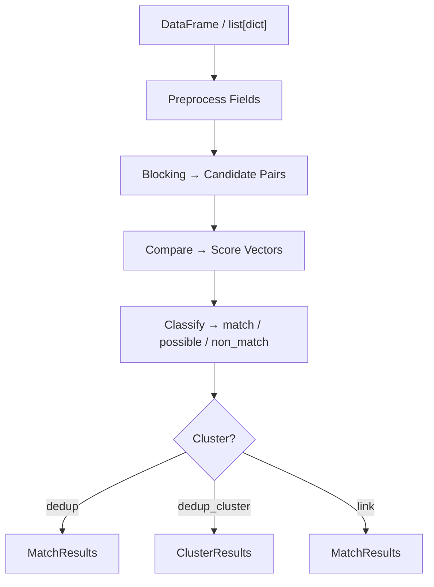

# Record Linkage Pipeline

The `ReclinkPipeline` provides a fluent builder API for constructing end-to-end record linkage and deduplication workflows. A pipeline chains together four stages -- preprocessing, blocking, comparison, and classification -- with an optional clustering step.

```python
import pandas as pd
from reclink.pipeline import ReclinkPipeline

pipeline = (
    ReclinkPipeline.builder()
    .preprocess("first_name", ["fold_case", "strip_punctuation"])
    .preprocess("last_name", ["fold_case"])
    .block_phonetic("last_name", algorithm="soundex")
    .compare_string("first_name", metric="jaro_winkler")
    .compare_string("last_name", metric="jaro_winkler")
    .classify_threshold(0.85)
    .build()
)

matches = pipeline.dedup(df, id_column="id")
```

The pipeline accepts **pandas DataFrames**, **polars DataFrames**, or **lists of dicts** as input, and returns results in the same container type.



---

## Builder

### ReclinkPipeline.builder()

```python
from reclink.pipeline import ReclinkPipeline

builder = ReclinkPipeline.builder()
```

Returns a `PipelineBuilder` instance. Chain configuration methods, then call `.build()` to produce a `ReclinkPipeline`.

---

## Preprocessing

### .preprocess(field, operations)

Apply a sequence of text-cleaning operations to a field before comparison.

```python
builder.preprocess("name", ["fold_case", "normalize_whitespace", "strip_punctuation"])
```

<Table
  columns={["Parameter", "Type", "Description"]}
  rows={[
    ["`field`", "`str`", "Field name to preprocess."],
    ["`operations`", "`list[str]`", "Ordered list of operation names."],
  ]}
/>

**Available operations:**

<Table
  columns={["Operation", "Description"]}
  rows={[
    ["`\"fold_case\"`", "Lowercase (Unicode-aware)."],
    ["`\"normalize_whitespace\"`", "Collapse runs of whitespace to a single space; strip leading/trailing."],
    ["`\"strip_punctuation\"`", "Remove punctuation characters."],
    ["`\"standardize_name\"`", "Normalize name prefixes, suffixes, and titles."],
    ["`\"remove_stop_words\"`", "Remove common English stop words."],
    ["`\"expand_abbreviations\"`", 'Expand common abbreviations (e.g., "St." to "Street").'],
    ["`\"strip_diacritics\"`", "Remove diacritical marks (accents)."],
    ["`\"normalize_unicode_nfc\"`", "NFC Unicode normalization."],
    ["`\"normalize_unicode_nfkc\"`", "NFKC Unicode normalization."],
  ]}
/>

---

## Blocking strategies

Blocking reduces the number of comparisons from O(n^2) to approximately O(n) by grouping records into candidate pairs. You can chain multiple blocking strategies -- their candidate sets are unioned.

### .block_exact(field)

Block on exact field value equality.

```python
builder.block_exact("zip_code")
```

<Table
  columns={["Parameter", "Type", "Description"]}
  rows={[
    ["`field`", "`str`", "Field name for exact blocking."],
  ]}
/>

### .block_phonetic(field, algorithm)

Block on the phonetic encoding of a field. Records with the same phonetic code become candidates.

```python
builder.block_phonetic("last_name", algorithm="soundex")
```

<Table
  columns={["Parameter", "Type", "Default", "Description"]}
  rows={[
    ["`field`", "`str`", "--", "Field name for phonetic blocking."],
    ["`algorithm`", "`str`", "`\"soundex\"`", 'One of `"soundex"`, `"metaphone"`, `"double_metaphone"`, `"nysiis"`, `"caverphone"`, `"cologne_phonetic"`, `"beider_morse"`.'],
  ]}
/>

### .block_sorted_neighborhood(field, window)

Sort records by the field value, then compare each record to its neighbors within a sliding window.

```python
builder.block_sorted_neighborhood("last_name", window=5)
```

<Table
  columns={["Parameter", "Type", "Default", "Description"]}
  rows={[
    ["`field`", "`str`", "--", "Field name to sort on."],
    ["`window`", "`int`", "`3`", "Window size for neighbor comparison."],
  ]}
/>

### .block_qgram(field, q, threshold)

Block using character q-gram (n-gram) overlap. Records sharing at least `threshold` q-grams become candidates.

```python
builder.block_qgram("last_name", q=3, threshold=2)
```

<Table
  columns={["Parameter", "Type", "Default", "Description"]}
  rows={[
    ["`field`", "`str`", "--", "Field name for q-gram blocking."],
    ["`q`", "`int`", "`3`", "N-gram size."],
    ["`threshold`", "`int`", "`1`", "Minimum shared q-grams to form a candidate pair."],
  ]}
/>

### .block_lsh(field, num_hashes, num_bands)

Block using Locality-Sensitive Hashing (MinHash + banding). Efficient for large datasets where approximate blocking is acceptable.

```python
builder.block_lsh("full_name", num_hashes=100, num_bands=20)
```

<Table
  columns={["Parameter", "Type", "Default", "Description"]}
  rows={[
    ["`field`", "`str`", "--", "Field name for LSH blocking."],
    ["`num_hashes`", "`int`", "`100`", "Number of hash functions (signature length)."],
    ["`num_bands`", "`int`", "`20`", "Number of bands for the banding technique. Must evenly divide `num_hashes`."],
  ]}
/>

### .block_canopy(field, t_tight, t_loose, metric)

Block using canopy clustering with two thresholds. Records within the loose threshold form candidate pairs; the tight threshold controls canopy removal.

```python
builder.block_canopy("last_name", t_tight=0.9, t_loose=0.5, metric="jaro_winkler")
```

<Table
  columns={["Parameter", "Type", "Default", "Description"]}
  rows={[
    ["`field`", "`str`", "--", "Field name for canopy blocking."],
    ["`t_tight`", "`float`", "`0.9`", "Tight threshold -- records within this similarity are strongly linked and removed from the candidate pool."],
    ["`t_loose`", "`float`", "`0.5`", "Loose threshold -- records within this similarity are candidates."],
    ["`metric`", "`str`", "`\"jaro_winkler\"`", "Similarity metric for canopy distance."],
  ]}
/>

### .block_numeric(field, bucket_size)

Block numeric fields by bucketing into fixed-width ranges. Adjacent buckets are also compared to handle boundary effects.

```python
builder.block_numeric("age", bucket_size=5.0)
```

<Table
  columns={["Parameter", "Type", "Default", "Description"]}
  rows={[
    ["`field`", "`str`", "--", "Field name for numeric blocking."],
    ["`bucket_size`", "`float`", "`5.0`", "Width of each bucket (e.g., `5.0` groups ages 20-24, 25-29, etc.)."],
  ]}
/>

### .block_date(field, resolution)

Block by truncating a date field to the given resolution.

```python
builder.block_date("birth_date", resolution="year")
```

<Table
  columns={["Parameter", "Type", "Default", "Description"]}
  rows={[
    ["`field`", "`str`", "--", "Field name for date blocking."],
    ["`resolution`", "`str`", "`\"year\"`", 'One of `"year"`, `"month"`, `"day"`.'],
  ]}
/>

### .block_custom(name)

Block using a custom blocker registered via `register_blocker`.

```python
from reclink import register_blocker

class ZipPrefixBlocker:
    def block_key(self, record):
        return record.get("zip", "")[:3]

register_blocker("zip_prefix", ZipPrefixBlocker())
builder.block_custom("zip_prefix")
```

<Table
  columns={["Parameter", "Type", "Description"]}
  rows={[
    ["`name`", "`str`", "Name of the registered custom blocker."],
  ]}
/>

See the [Custom Plugins guide](/docs/guides/custom-plugins) for details on registering blockers.

---

## Comparators

Comparators produce a per-field similarity score in `[0, 1]` for each candidate pair. Add one comparator per field you want to compare. The resulting score vector is passed to the classifier.

### .compare_string(field, metric)

Compare a text field using a string similarity metric.

```python
builder.compare_string("first_name", metric="jaro_winkler")
builder.compare_string("last_name", metric="jaro_winkler")
```

<Table
  columns={["Parameter", "Type", "Default", "Description"]}
  rows={[
    ["`field`", "`str`", "--", "Field name to compare."],
    ["`metric`", "`str`", "`\"jaro_winkler\"`", 'Any string metric name: `"levenshtein"`, `"jaro_winkler"`, `"cosine"`, `"token_sort"`, `"token_set"`, etc.'],
  ]}
/>

### .compare_exact(field)

Binary comparison: `1.0` if the field values are identical, `0.0` otherwise.

```python
builder.compare_exact("gender")
```

<Table
  columns={["Parameter", "Type", "Description"]}
  rows={[
    ["`field`", "`str`", "Field name to compare."],
  ]}
/>

### .compare_numeric(field, max_diff)

Compare numeric fields. Returns `1.0 - (abs(a - b) / max_diff)`, clamped to `[0, 1]`.

```python
builder.compare_numeric("age", max_diff=10.0)
```

<Table
  columns={["Parameter", "Type", "Default", "Description"]}
  rows={[
    ["`field`", "`str`", "--", "Field name to compare."],
    ["`max_diff`", "`float`", "`10.0`", "Difference at which similarity becomes 0."],
  ]}
/>

### .compare_date(field)

Compare date fields. Returns a similarity score based on the temporal distance between two dates.

```python
builder.compare_date("birth_date")
```

<Table
  columns={["Parameter", "Type", "Description"]}
  rows={[
    ["`field`", "`str`", "Field name to compare."],
  ]}
/>

### .compare_phonetic(field, algorithm)

Binary phonetic comparison: `1.0` if the phonetic encodings match, `0.0` otherwise.

```python
builder.compare_phonetic("last_name", algorithm="soundex")
```

<Table
  columns={["Parameter", "Type", "Default", "Description"]}
  rows={[
    ["`field`", "`str`", "--", "Field name to compare."],
    ["`algorithm`", "`str`", "`\"soundex\"`", 'Phonetic algorithm: `"soundex"`, `"metaphone"`, `"double_metaphone"`, `"nysiis"`, `"caverphone"`, `"cologne_phonetic"`, `"beider_morse"`.'],
  ]}
/>

### .compare_custom(field, name)

Compare using a custom comparator registered via `register_comparator`.

```python
from reclink import register_comparator

def compare_initials(a: str, b: str) -> float:
    return 1.0 if a[0] == b[0] else 0.0

register_comparator("initials", compare_initials)
builder.compare_custom("first_name", "initials")
```

<Table
  columns={["Parameter", "Type", "Description"]}
  rows={[
    ["`field`", "`str`", "Field name to compare."],
    ["`name`", "`str`", "Name of the registered custom comparator."],
  ]}
/>

---

## Classifiers

The classifier takes the score vector (one float per comparator) and assigns each pair a match class: `"match"`, `"non_match"`, or `"possible"`.

### .classify_threshold(threshold)

Classify based on the **average** of all field scores. Pairs with an average score at or above `threshold` are matches.

```python
builder.classify_threshold(0.85)
```

<Table
  columns={["Parameter", "Type", "Description"]}
  rows={[
    ["`threshold`", "`float`", "Average score threshold."],
  ]}
/>

**Match classes:** `"match"` or `"non_match"`.

### .classify_weighted(weights, threshold)

Classify based on a **weighted sum** of field scores.

```python
builder.classify_weighted(weights=[0.6, 0.4], threshold=0.80)
```

<Table
  columns={["Parameter", "Type", "Description"]}
  rows={[
    ["`weights`", "`list[float]`", "Per-field weights (one per comparator, in order)."],
    ["`threshold`", "`float`", "Weighted sum threshold."],
  ]}
/>

**Match classes:** `"match"` or `"non_match"`.

### .classify_threshold_bands(upper, lower)

Three-band classification using the average score.

```python
builder.classify_threshold_bands(upper=0.90, lower=0.70)
```

<Table
  columns={["Parameter", "Type", "Description"]}
  rows={[
    ["`upper`", "`float`", 'Scores >= `upper` are `"match"`.'],
    ["`lower`", "`float`", 'Scores < `lower` are `"non_match"`. Scores in between are `"possible"`.'],
  ]}
/>

### .classify_weighted_bands(weights, upper, lower)

Three-band classification using a weighted sum.

```python
builder.classify_weighted_bands(weights=[0.6, 0.4], upper=0.90, lower=0.70)
```

<Table
  columns={["Parameter", "Type", "Description"]}
  rows={[
    ["`weights`", "`list[float]`", "Per-field weights."],
    ["`upper`", "`float`", 'Weighted sum >= `upper` is `"match"`.'],
    ["`lower`", "`float`", 'Weighted sum < `lower` is `"non_match"`. Between is `"possible"`.'],
  ]}
/>

### .classify_fellegi_sunter(m_probs, u_probs, upper, lower)

Classify using the [Fellegi-Sunter](https://en.wikipedia.org/wiki/Record_linkage#Fellegi%E2%80%93Sunter_model) probabilistic model with known parameters.

```python
builder.classify_fellegi_sunter(
    m_probs=[0.95, 0.90],    # P(agree | match)
    u_probs=[0.05, 0.10],    # P(agree | non-match)
    upper=8.0,                # Log-likelihood ratio threshold for match
    lower=2.0,                # Log-likelihood ratio threshold for non-match
)
```

<Table
  columns={["Parameter", "Type", "Description"]}
  rows={[
    ["`m_probs`", "`list[float]`", "P(agree | match) for each field."],
    ["`u_probs`", "`list[float]`", "P(agree | non-match) for each field."],
    ["`upper`", "`float`", "Upper log-likelihood ratio threshold."],
    ["`lower`", "`float`", "Lower log-likelihood ratio threshold."],
  ]}
/>

### .classify_fellegi_sunter_auto(max_iterations, convergence_threshold, initial_p_match)

Unsupervised Fellegi-Sunter classification. Parameters are estimated automatically via the EM algorithm during pipeline execution -- no labeled data required.

```python
builder.classify_fellegi_sunter_auto(
    max_iterations=100,
    convergence_threshold=1e-6,
    initial_p_match=0.1,
)
```

<Table
  columns={["Parameter", "Type", "Default", "Description"]}
  rows={[
    ["`max_iterations`", "`int`", "`100`", "Maximum EM iterations."],
    ["`convergence_threshold`", "`float`", "`1e-6`", "Stop when parameter changes fall below this value."],
    ["`initial_p_match`", "`float`", "`0.1`", "Initial prior probability of a match."],
  ]}
/>

### .classify_custom(name)

Classify using a custom classifier registered via `register_classifier`.

```python
from reclink import register_classifier

def my_classifier(scores: list[float]) -> str:
    avg = sum(scores) / len(scores) if scores else 0
    return "match" if avg > 0.8 else "non_match"

register_classifier("my_clf", my_classifier)
builder.classify_custom("my_clf")
```

<Table
  columns={["Parameter", "Type", "Description"]}
  rows={[
    ["`name`", "`str`", "Name of the registered custom classifier."],
  ]}
/>

### estimate_fellegi_sunter(vectors)

Standalone EM estimation of Fellegi-Sunter parameters from comparison vectors. Useful for inspecting parameters before building a pipeline.

```python
from reclink import estimate_fellegi_sunter

result = estimate_fellegi_sunter(
    vectors=[[0.95, 0.88], [0.12, 0.05], [0.90, 0.92]],
    max_iterations=100,
    convergence_threshold=1e-6,
    initial_p_match=0.1,
)

result.m_probs       # [0.94, 0.91]
result.u_probs       # [0.08, 0.04]
result.p_match       # 0.33
result.iterations    # 42
result.converged     # True
```

**Returns:** `EmResult` with fields `m_probs`, `u_probs`, `p_match`, `iterations`, `converged`.

---

## Clustering

Optionally group matched pairs into transitive clusters of duplicate records.

### .cluster_connected_components()

Union-find based clustering. If A matches B and B matches C, all three are placed in the same cluster.

```python
builder.cluster_connected_components()
```

### .cluster_hierarchical(linkage, threshold)

Hierarchical agglomerative clustering with a distance threshold for merging.

```python
builder.cluster_hierarchical(linkage="single", threshold=0.5)
```

<Table
  columns={["Parameter", "Type", "Default", "Description"]}
  rows={[
    ["`linkage`", "`str`", "`\"single\"`", 'Linkage criterion: `"single"`, `"complete"`, or `"average"`.'],
    ["`threshold`", "`float`", "`0.5`", "Distance threshold for merging clusters."],
  ]}
/>

---

## Execution

### pipeline.dedup(data, id_column)

Find duplicate pairs within a single dataset.

```python
import pandas as pd

df = pd.DataFrame({
    "id": ["1", "2", "3"],
    "first_name": ["Jon", "John", "Jane"],
    "last_name": ["Smith", "Smyth", "Doe"],
})

matches = pipeline.dedup(df, id_column="id")
#    left_id right_id     score match_class          scores
# 0       1        2  0.921...       match  [0.832, 1.0...]
```

<Table
  columns={["Parameter", "Type", "Default", "Description"]}
  rows={[
    ["`data`", "DataFrame or `list[dict]`", "--", "Input data. Accepts pandas, polars, or list of dicts."],
    ["`id_column`", "`str`", "`\"id\"`", "Column name for record identifiers."],
  ]}
/>

**Returns:** Match results in the same container type as the input, with columns `left_id`, `right_id`, `score`, `match_class`, and `scores`.

### pipeline.dedup_cluster(data, id_column)

Deduplicate and group results into clusters. Requires a clustering step (`.cluster_connected_components()` or `.cluster_hierarchical()`) in the builder.

```python
clusters = pipeline.dedup_cluster(df, id_column="id")
# DataFrame: cluster_id | record_id
# Or list of lists: [["1", "2"], ["3"]]
```

<Table
  columns={["Parameter", "Type", "Default", "Description"]}
  rows={[
    ["`data`", "DataFrame or `list[dict]`", "--", "Input data."],
    ["`id_column`", "`str`", "`\"id\"`", "Column name for record identifiers."],
  ]}
/>

**Returns:** When input is a DataFrame, returns a DataFrame with `cluster_id` and `record_id` columns. When input is a list of dicts, returns `list[list[str]]`.

### pipeline.link(left, right, id_column)

Link records across two datasets.

```python
df_left = pd.DataFrame({
    "id": ["L1", "L2"],
    "name": ["Jon Smith", "Jane Doe"],
})
df_right = pd.DataFrame({
    "id": ["R1", "R2"],
    "name": ["John Smyth", "Janet Doe"],
})

matches = pipeline.link(df_left, df_right, id_column="id")
```

<Table
  columns={["Parameter", "Type", "Default", "Description"]}
  rows={[
    ["`left`", "DataFrame or `list[dict]`", "--", "First dataset."],
    ["`right`", "DataFrame or `list[dict]`", "--", "Second dataset."],
    ["`id_column`", "`str`", "`\"id\"`", "Column name for record identifiers."],
  ]}
/>

**Returns:** Match results in the same container type as `left`.

---

## MatchResult

Each row in the output contains:

<Table
  columns={["Field", "Type", "Description"]}
  rows={[
    ["`left_id`", "`str`", "ID of the first record in the pair."],
    ["`right_id`", "`str`", "ID of the second record in the pair."],
    ["`score`", "`float`", "Overall match score (average or weighted sum, depending on classifier)."],
    ["`scores`", "`list[float]`", "Per-field similarity scores, one per comparator in order."],
    ["`match_class`", "`str`", 'Classification result: `"match"`, `"non_match"`, or `"possible"`.'],
  ]}
/>

---

## Serialization

Save and restore pipeline configurations for reproducible workflows.

```python
# To/from JSON string
json_str = pipeline.to_json()
pipeline = ReclinkPipeline.from_json(json_str)

# To/from file
pipeline.to_file("pipeline.json")
pipeline = ReclinkPipeline.from_file("pipeline.json")
```

---

## Profiling

Enable per-stage timing to identify bottlenecks.

```python
pipeline = (
    ReclinkPipeline.builder()
    # ... configuration ...
    .build()
    .with_profiling()
)

matches = pipeline.dedup(df)

stats = pipeline.profiling_stats
# {"blocking": 1234567, "comparison": 9876543, "classification": 123456}
# Values are elapsed nanoseconds per stage.
```

---

## Complete example

```python
import pandas as pd
from reclink.pipeline import ReclinkPipeline

# Sample data
df = pd.DataFrame({
    "id": ["1", "2", "3", "4", "5"],
    "first_name": ["Jon", "John", "Jane", "Janet", "Jonathan"],
    "last_name": ["Smith", "Smyth", "Doe", "Doe", "Smith"],
    "birth_year": ["1985", "1985", "1990", "1990", "1985"],
})

# Build pipeline
pipeline = (
    ReclinkPipeline.builder()
    # Preprocessing
    .preprocess("first_name", ["fold_case", "strip_punctuation"])
    .preprocess("last_name", ["fold_case"])
    # Blocking (union of both strategies)
    .block_phonetic("last_name", algorithm="soundex")
    .block_sorted_neighborhood("first_name", window=3)
    # Comparison
    .compare_string("first_name", metric="jaro_winkler")
    .compare_string("last_name", metric="jaro_winkler")
    .compare_exact("birth_year")
    # Classification
    .classify_weighted_bands(
        weights=[0.4, 0.4, 0.2],
        upper=0.85,
        lower=0.65,
    )
    # Clustering
    .cluster_connected_components()
    .build()
)

# Deduplicate
matches = pipeline.dedup(df, id_column="id")
print(matches)

# Deduplicate with clustering
clusters = pipeline.dedup_cluster(df, id_column="id")
print(clusters)
```

## Related

- [Scoring & Presets](/docs/api/scoring) -- composite scorers for standalone matching
- [Evaluation](/docs/api/evaluation) -- precision, recall, and F1 for measuring pipeline quality
- [Index Structures](/docs/api/indexes) -- sub-linear search indexes used by LSH and q-gram blocking
- [String Metrics](/docs/api/string-metrics) -- all available metric names for `compare_string`
- [Phonetic](/docs/api/phonetic) -- phonetic algorithm details for `block_phonetic` and `compare_phonetic`
- [Custom Plugins](/docs/guides/custom-plugins) -- registering custom blockers, comparators, and classifiers
