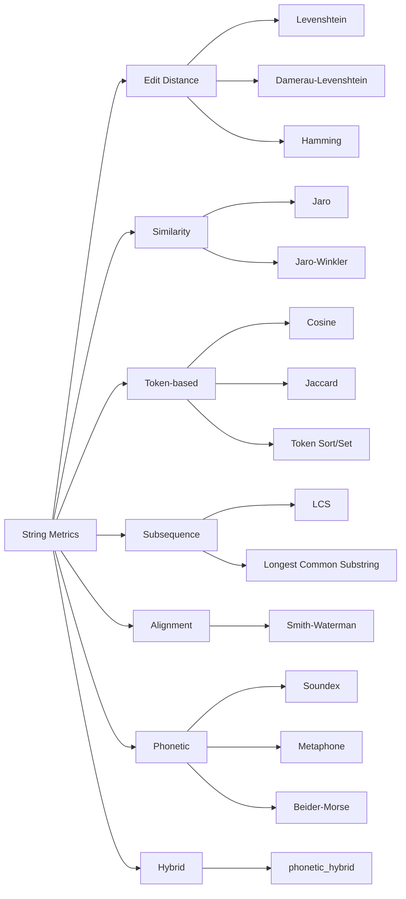
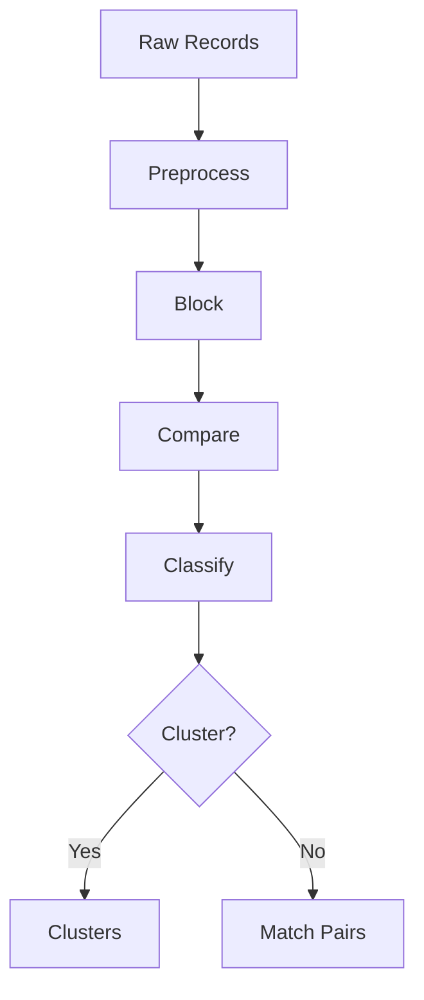

# Core Concepts

## String similarity vs. distance

reclink provides two families of functions for comparing strings:

- **Distance functions** (e.g., `levenshtein`) return an integer count of operations needed to transform one string into another. Lower is more similar.
- **Similarity functions** (e.g., `jaro_winkler`) return a float in `[0, 1]` where `1.0` means identical. Higher is more similar.

Most metrics have both variants:

```python
from reclink import levenshtein, levenshtein_similarity

levenshtein("kitten", "sitting")            # 3 (distance)
levenshtein_similarity("kitten", "sitting")  # 0.571 (similarity)
```

## Metric categories

<Table
  columns={["Category", "Examples", "Best for"]}
  rows={[
    [<strong>Edit distance</strong>, "Levenshtein, Damerau-Levenshtein, Hamming", "Typos, OCR errors"],
    [<strong>Similarity</strong>, "Jaro, Jaro-Winkler", "Names, short strings"],
    [<strong>Token-based</strong>, "Cosine, Jaccard, Token Sort/Set Ratio", "Word-order differences"],
    [<strong>Subsequence</strong>, "LCS, Longest Common Substring", "Partial matches"],
    [<strong>Alignment</strong>, "Smith-Waterman", "Biological sequences, flexible gaps"],
    [<strong>Phonetic</strong>, "Soundex, Metaphone, Double Metaphone", "Names that sound alike"],
    [<strong>Hybrid</strong>, "`phonetic_hybrid`", "Combining phonetic + edit distance"],
  ]}
/>



## Phonetic algorithms

Phonetic algorithms encode strings by how they sound. Two names with the same phonetic code are likely the same name, even if spelled differently:

```python
from reclink import soundex

soundex("Smith")  # "S530"
soundex("Smyth")  # "S530"  -- same!
```

Different algorithms suit different languages and use cases. See the [Phonetic API reference](/docs/api/phonetic) for details.

## Record linkage pipeline

Record linkage finds matching records across one or two datasets. reclink's pipeline has four stages:



### 1. Preprocessing

Clean and normalize field values before comparison:

```python
.preprocess("name", ["fold_case", "strip_punctuation", "normalize_whitespace"])
```

### 2. Blocking

Blocking reduces comparisons from O(n^2) to roughly O(n) by grouping records that are likely to match:

```python
.block_phonetic("last_name", algorithm="soundex")
```

Without blocking, 10,000 records would require 50 million comparisons. With phonetic blocking, typically only 1-5% of pairs are compared.

### 3. Comparison

Each candidate pair is compared field-by-field to produce a similarity score vector:

```python
.compare_string("first_name", metric="jaro_winkler")
.compare_string("last_name", metric="jaro_winkler")
```

### 4. Classification

The score vector is classified into match/non-match (or a three-band match/possible-match/non-match):

```python
.classify_threshold(0.85)
# or
.classify_fellegi_sunter_auto()  # unsupervised probabilistic model
```

### Optional: Clustering

Group matched pairs into clusters of duplicate records:

```python
.cluster_connected_components()
```

## Index structures

For large datasets, linear scanning is too slow. reclink provides specialized index structures for sub-linear search:

- **BK-tree** — for edit-distance metrics (exact threshold search)
- **VP-tree** — for any metric (k-nearest and range search)
- **N-gram index** — for approximate matching via shared n-gram overlap
- **MmapNgramIndex** — memory-mapped n-gram index for datasets larger than RAM
- **MinHash/LSH** — approximate nearest-neighbor search for large collections

## Composite scorer

Combine multiple metrics with weights for more robust matching:

```python
from reclink import CompositeScorer

scorer = CompositeScorer([
    ("jaro_winkler", 0.6),
    ("token_sort", 0.4),
])
scorer.similarity("Jon Smith", "John Smyth")  # weighted blend
```

Pre-tuned presets are available for common use cases:

```python
from reclink.presets import name_matching, address_matching
```

## Edge cases

reclink handles empty strings consistently:

- Distance metrics return the length of the non-empty string when one input is empty
- Similarity metrics return `0.0` when one input is empty, `1.0` when both are empty

## Next steps

- **[String Metrics API](/docs/api/string-metrics)** — Full reference for all metrics
- **[Pipeline API](/docs/api/pipeline)** — Complete pipeline configuration
- **[Name Matching Guide](/docs/guides/name-matching)** — End-to-end tutorial
